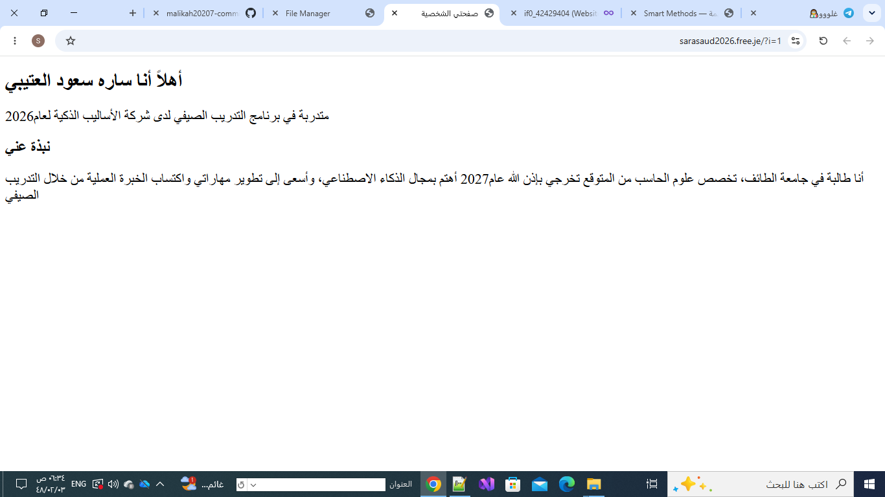

# my-first-website
My first web development project built using HTML as part of the Web Development learning path.
## Features
- Simple website structure
- Organized web pages
- Easy navigation

## Technologies Used
- HTML

## Project Goal
To learn the basics of HTML and create a simple web page.

## Screenshot

## Author
Sara Saud Alotaibi
